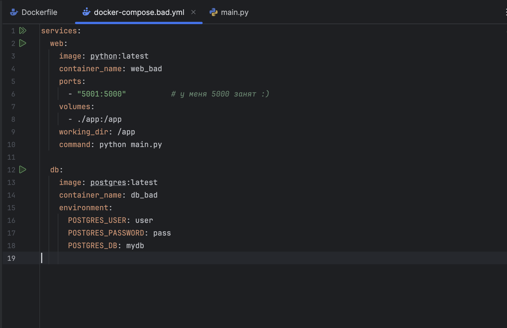
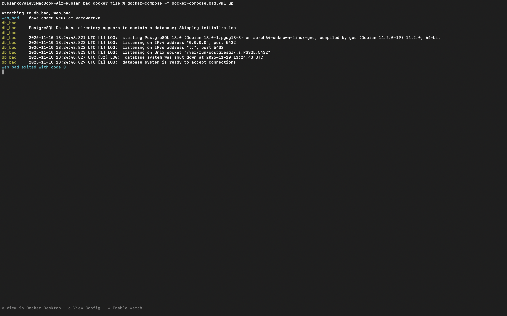
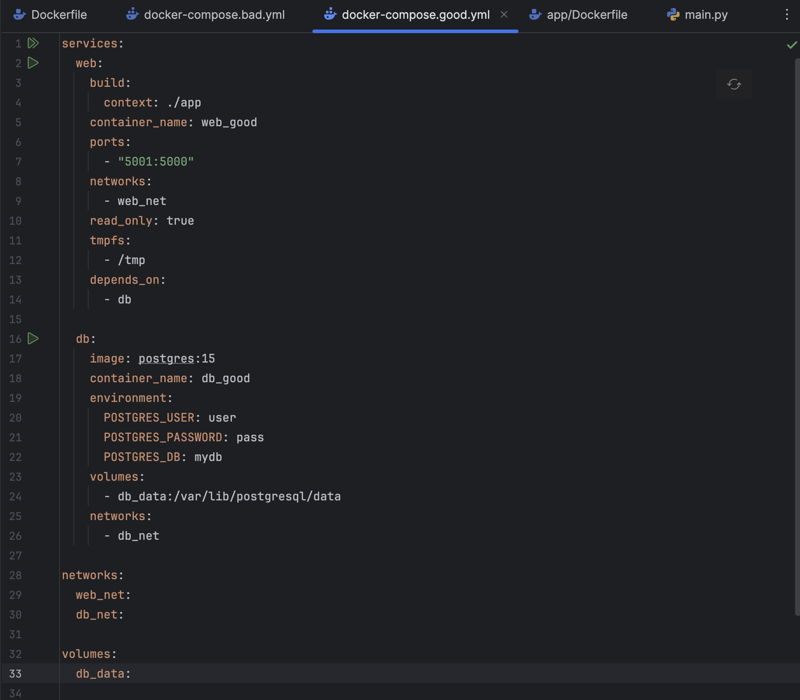
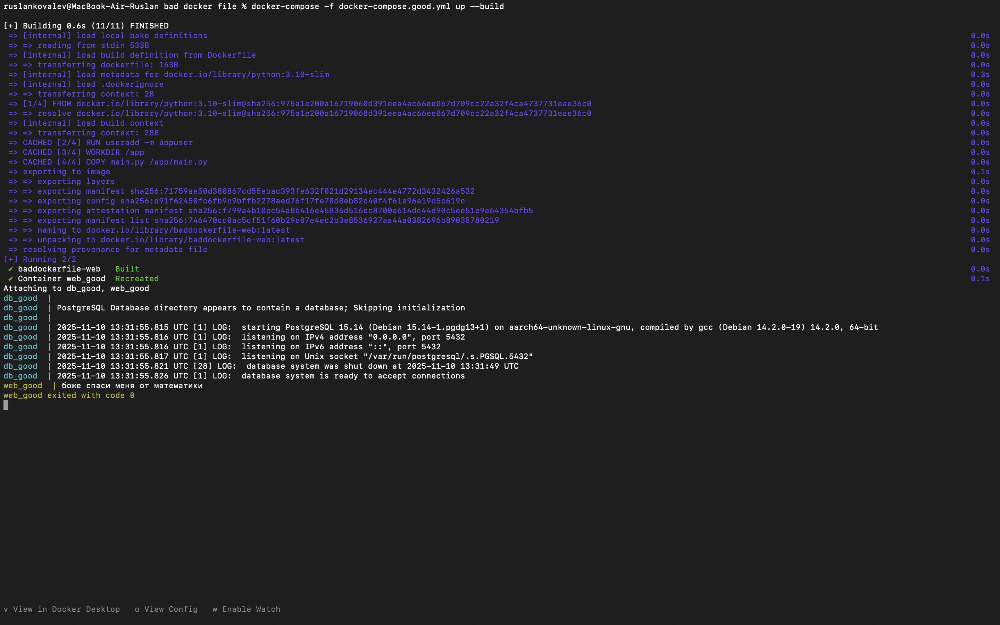

Лаба 2*

Для выполнения этой лабы и предыдущей (2 без звездочки) посмотрел 2 видео Влада Мишустина и прочитал 3 гайда.

Плохой Docker Compose

И его ран 

Теперь хороший Compose

И его ран

Какие плохие практики и как исправили?
| №  | Плохая практика                                                             | Почему это плохо                                                                               | Как исправлено                                                       |
| --- | --------------------------------------------------------------------------- | ---------------------------------------------------------------------------------------------- | ------------------------------------------------------------------------------------------------ |
| 1 | Используются latest теги для образов (python:latest, postgres:latest) | Версия меняется, сборка может стать нестабильной или несовместимой (взрыв, кровище и тд.)          | Указал конкретные версии (python:3.10-slim, postgres:15) - (спаслись от взрывов и кровищи) |
| 2 | Контейнеры web и db находятся в одной сети                              | Они видят друг друга по сети, что повышает риск утечки данных или несанкционированного доступа(на хабре так написали) | Создал две изолированные сети (web_net, db_net) - контейнеры не видят друг друга            |
| 3 | Локальная папка ./app монтируется в контейнер (volumes)                 | Контейнер получает доступ к файлам хоста, возможны ошибки или изменение данных                 | Код копируется в образ при сборке (COPY . /app) -контейнер становится независим от хоста      |

~~"После предыдущих пунктов в хорошем файле настроить сервисы так, чтобы контейнеры в рамках этого compose-проекта так же поднимались вместе, 
но не "видели" друг друга по сети. В отчете описать, как этого добились и кратко объяснить принцип такой изоляции"~~
**Сделал это изначально в good compose.** Создал две отдельные сети - web.net и db.net, каждый из сервисов подключен к своей. 
А depends_on: - db гарантирует, что контейнер db_good запустится перед web_good.

**Принцип изоляции:
Docker создаёт для каждой сети отдельный bridge, в котором находятся только контейнеры этой сети.
Контейнеры внутри одной сети могут общаться по имени сервиса (db, web), а в разных сетях нет.**

Выполнил Ковалев Руслан Бабекович
